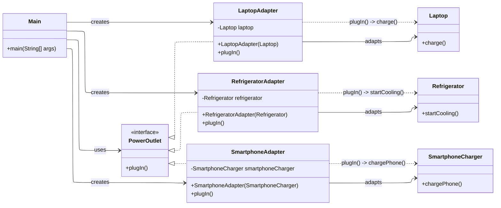

# Lab Assignment 3 Adapter Pattern

## Plugging Devices into Power Outlets

You are developing an application that helps users manage and control various electronic devices by plugging them into power outlets. Each device has different plug types, voltage, and amperage requirements, so the application uses adapters to make them compatible with a standard outlet interface.

### Adaptee Objects

- Laptop - Represents a laptop device that needs to be plugged into a power source. It has the `charge()` method.
- Refrigerator - Represents a refrigerator device that requires a power source. It has the `startCooling()` method.
- SmartphoneCharger - Represents a smartphone charger that needs to be plugged in for charging. It has the `chargePhone()` method.

### Target Object

- PowerOutlet - Represents a standard power outlet with a common interface for plugging in devices. It defines the `plugIn()` method as the target method.

### Adapter Objects

- LaptopAdapter - An adapter for plugging a laptop into a standard power outlet. It adapts the `Laptop` to the `PowerOutlet` interface, translating `plugIn()` to `charge()`.
- RefrigeratorAdapter - An adapter for plugging a refrigerator into a standard power outlet. It adapts the `Refrigerator` to the `PowerOutlet` interface, translating `plugIn()` to `startCooling()`.
- SmartphoneAdapter - An adapter for plugging a smartphone charger into a standard power outlet. It adapts the `SmartphoneCharger` to the `PowerOutlet` interface, translating `plugIn()` to `chargePhone()`.

### UML Diagram

This design follows the Adapter Pattern by keeping a common `PowerOutlet` interface while adapting different device-specific APIs to the same plug-in behavior.
